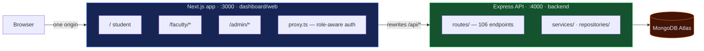

# PlacePrep — NST Interview Prep Portal

A data-driven portal with two use cases — helping NST students prepare for technical
interviews at specific companies, and helping faculty align the B.Tech CS & AI
curriculum with what industry actually tests for.

Both are powered by the same dataset: interview questions, hiring patterns and skill
requirements scraped and curated from public sources.

---

## Current State

**Single Next.js app + a standalone Express API, sharing one MongoDB Atlas database.**

The three separate portal deployments the earlier version of this document described
(student / faculty / admin, each its own Next.js app) were merged into one. They
already shared a database, a JWT secret and a backend library, so the split bought no
isolation while costing three dev servers, three dependency trees and a cross-origin
auth handoff that passed the session token in a URL.



Next rewrites `/api/*` to the Express server, so the browser only ever sees one
origin. Cookies stay same-origin and there is no CORS layer — deliberately, since
adding one would recreate the problem the merge removed.

| | |
|---|---|
| Frontend | Next.js 16 (App Router, Turbopack), React 19, Tailwind v4, SWR |
| API | Express 5 on Node, TypeScript via `tsx` |
| Database | MongoDB Atlas via Mongoose |
| Auth | JWT in an HttpOnly cookie, verified in `proxy.ts` (edge) and per route |

### Roles and URLs

| Role | URL prefix | Pages |
|---|---|---|
| Student | `/` — `/dashboard`, `/practice`, `/roadmap`, … | 16 |
| Faculty | `/faculty/*` | 14 |
| Admin | `/admin/*` | 22 |

`proxy.ts` maps each prefix to the roles allowed on it. `/api/staff/*` admits faculty
**or** admin, for features both author.

### Deployment

The frontend is deployable to Vercel as before. **The Express API is not yet
deployed** — Vercel cannot host a long-running process, so it needs a Node host
(Render, Railway, Fly). `API_URL` is the only knob: point it at the deployed API and
no code changes are needed. Until then the project runs locally.

---

## Getting Started

```bash
git clone git@github.com:sourabh14022004/Place_Prep_Sourabh.git
cd Place_Prep_Sourabh
npm install
```

Copy the env templates and fill them in:

```bash
cp backend/.env.example backend/.env.local
cp dashboard/web/.env.example dashboard/web/.env.local
```

Both files document their own fields. Three things are easy to get wrong:

- `MONGODB_URI` — special characters in the password must be percent-encoded (`@` becomes `%40`)
- `JWT_SECRET` — minimum 32 characters, and **byte-identical in both files**; if they diverge every request 401s
- `API_URL` (web) must match `API_PORT` (backend)

Then:

```bash
npm run dev
```

That starts both processes under one command — the API on `:4000` and the web app on
`:3000`. Open http://localhost:3000.

| Command | Does |
|---|---|
| `npm run dev` | API + web together |
| `npm run dev:api` / `npm run dev:web` | one at a time |
| `npm run typecheck` | both workspaces |
| `npm run build` | both workspaces |

### If the database won't connect

MongoDB Atlas rejects connections from IPs that aren't allowlisted, which is the
usual cause when it breaks after switching networks. Add your current IP under
Atlas → **Network Access**. The API starts and keeps serving even when the database
is unreachable — `/health` reports `{"status":"degraded"}` and data routes return
`503` — and reconnects on its own once access is restored, with no restart.

---

## Project Structure

```
Place_Prep_Sourabh/
├── backend/                  Express API (workspace: placeprep-backend)
│   └── src/
│       ├── server.ts         entry — listen, graceful shutdown
│       ├── app.ts            express app, shared Mongo pool
│       ├── http/             Express ↔ Web Fetch adapter + filesystem router
│       ├── routes/           106 endpoints, URL derived from directory path
│       ├── services/         business logic (11)
│       ├── repositories/     data access (12)
│       ├── models/           Mongoose schemas (20)
│       └── utils/            auth, errors, JWT, rate limiting
│
├── dashboard/web/            Next.js app (workspace: placeprep-web)
│   ├── app/                  (app)/ student · faculty/ · admin/
│   ├── components/           shared + student/, faculty/, admin/, staff/
│   ├── lib/                  API clients and hooks
│   └── proxy.ts              role-aware auth middleware
│
├── scrapers/  pipeline/  schema/  data/    data collection (see below)
└── docs/
```

Routes are mounted by walking `backend/src/routes`, so a file's path *is* its URL —
`routes/questions/[id]/complete/route.ts` serves `/api/questions/:id/complete`. There
is no route manifest to drift out of sync.

---

## What's Built

**Student** — company-specific roadmaps generated from that student's self-ratings
(topics ordered by `frequency × weakness`), practice with MCQ support, progress
analytics with an activity heatmap, XP and streaks, leaderboards, doubts to faculty,
session booking, interview experience submissions.

**Faculty** — doubt resolution, session requests, student matrix, company rankings,
curriculum gap analysis, industry trends, report export.

**Admin** — overview and analytics (engagement, doubts, practice, placement), student
and faculty management, question moderation, company management, feature flags,
notifications.

**Custom roadmaps** *(faculty + admin)* — a multi-company plan authored by staff,
with questions arranged into weeks by hand, external LeetCode-style questions, and
publish / retire controls. Students discover and follow these from `/roadmap`.
Followers are linked live, so an edit reaches them immediately; progress is derived
by intersecting their completions with the roadmap's current question set, so
removing a question never costs anyone credit.

### Live data

| Collection | Count |
|---|---|
| Questions | 22,759 *(2,284 with no company — the shared generic pool)* |
| Companies | 676 |
| User roadmaps | 22 |
| Question completions | 373 |

---

## Use Cases

### 1 · Company-Specific Interview Prep (student-facing)

Answers questions like: what topics does Google test in SDE interviews? What is the
interview format at Amazon or Flipkart? Which problem categories appear most often at
a given company? Are there recurring system design or behavioural questions for a role?

### 2 · Curriculum Intelligence (faculty-facing)

> *Are the skills we teach in our B.Tech CS & AI curriculum aligned with what
> companies actually test and hire for?*

Maps structured interview data — topics, skills, problem types — against the course
syllabus to produce a **gap analysis**: topics industry expects but we don't teach,
and topics heavily covered that may have lower industry relevance.

---

## Data Collection

`scrapers/`, `pipeline/`, `schema/` and `data/` hold the collection side. Each carries
its own README; `pipeline/SOURCE-REGISTRY.md` tracks which sources have been worked.

Current state here is narrower than the catalogue below suggests: one scraper group is
implemented (`scrapers/group-a` — clone-and-parse, then promote-to-mongo), and
`data/filtered-output/` holds the prepared datasets and an execution report. The
remaining sources listed below are candidates, not completed integrations.

### Fields captured

- Company, role and level (SDE-1, SDE-2, Data Analyst, …)
- Round type (coding, system design, HR, managerial, aptitude)
- Topic / skill area (Dynamic Programming, OS, DBMS, ML, …)
- Problem statement or summary, and difficulty
- Source URL and collection date
- Frequency signal — how often a topic or question recurs

---

## Data Sources

> **Students — we need your help expanding this list!**
> Found a useful source not listed here? Open a PR and add it to the appropriate table below. See [Contributing a Data Source](#contributing-a-data-source) at the bottom of this page.

### DSA & Coding Problem Platforms

| Source | What It Contains |
|--------|-----------------|
| [GeeksForGeeks](https://www.geeksforgeeks.org) | Company-tagged DSA problems, interview experiences, topic-wise questions |
| [LeetCode Discuss](https://leetcode.com/discuss) | Company-tagged problems, community interview reports |
| [InterviewBit](https://www.interviewbit.com) | Topic and company-wise structured problem sets |
| [HackerRank](https://www.hackerrank.com) | Role-based coding challenges, company-sponsored contests |
| [HackerEarth](https://www.hackerearth.com) | Coding challenges, campus hiring contest archives |
| [CodeChef](https://www.codechef.com) | Competitive programming problems, company hiring contests |
| [Codeforces](https://codeforces.com) | Competitive programming problem archive |
| [AlgoExpert](https://www.algoexpert.io) | Curated interview problems with video explanations |
| [NeetCode](https://neetcode.io) | Curated LeetCode roadmap by topic and company |
| [Coding Ninjas](https://www.codingninjas.com) | Company-wise DSA problems, very popular in Indian colleges |
| [Educative.io](https://www.educative.io) | Grokking series — system design, coding patterns |

### Indian Placement & Job Portals

| Source | What It Contains |
|--------|-----------------|
| [AmbitionBox](https://www.ambitionbox.com) | Indian company-specific interview experiences and questions |
| [Naukri.com](https://www.naukri.com) | Job postings with skill tags relevant to Indian tech market |
| [PrepInsta](https://prepinsta.com) | Company-wise placement papers, aptitude & coding questions |
| [IndiaBix](https://www.indiabix.com) | Aptitude, verbal, technical MCQs — widely used for campus prep |
| [FacePrep](https://www.faceprep.in) | Company-specific placement prep, mock tests |
| [CareerRide](https://www.careerride.com) | Interview questions by company and technology |
| [Freshersworld](https://www.freshersworld.com) | Fresher job listings, off-campus drives, placement papers |
| [Workat.tech](https://workat.tech) | Indian startup interview experiences, DSA practice |
| [Instahyre](https://www.instahyre.com) | Indian tech hiring, skill-based job matching |

### Company Reviews & Interview Experiences

| Source | What It Contains |
|--------|-----------------|
| [Glassdoor](https://www.glassdoor.com) | Interview reviews, question logs by company and role, difficulty ratings |
| [Blind / TeamBlind](https://www.teamblind.com) | Anonymous tech worker posts — interview experiences, offers, comp data |
| [Levels.fyi](https://www.levels.fyi) | Compensation data + interview difficulty ratings by company and level |
| [Prepfully](https://prepfully.com) | Interview experiences and mock interview reviews |
| [CareerCup](https://www.careercup.com) | Interview questions shared by candidates, organized by company |

### Job Listings & Skills Intelligence

| Source | What It Contains |
|--------|-----------------|
| [LinkedIn Jobs](https://www.linkedin.com/jobs) | Job descriptions, required skills by company and role |
| [Indeed](https://www.indeed.com) | Job postings with skill requirements, salary estimates |
| [Wellfound (AngelList)](https://wellfound.com) | Startup job listings with explicit tech stack and skill requirements |
| [Cutshort](https://cutshort.io) | Indian tech hiring — skill-tagged job listings |

### Community & Discussion

| Source | What It Contains |
|--------|-----------------|
| [Reddit — r/cscareerquestions](https://www.reddit.com/r/cscareerquestions) | Anecdotal interview experiences, FAANG prep threads |
| [Reddit — r/india](https://www.reddit.com/r/india) | Indian company interview experiences, placement discussions |
| [Reddit — r/developersIndia](https://www.reddit.com/r/developersIndia) | Indian dev community — job prep, interview experiences |
| [Quora](https://www.quora.com) | Interview experience Q&As, company-specific threads |

### Curated Repositories & Open Content

| Source | What It Contains |
|--------|-----------------|
| [GitHub Repos](https://github.com) | Curated interview prep repos (e.g. awesome-interview-questions, system-design-primer) |
| [System Design Primer](https://github.com/donnemartin/system-design-primer) | Comprehensive system design interview resource |
| [Tech Interview Handbook](https://www.techinterviewhandbook.org) | Structured guide — algorithms, behavioral, offers |
| [NeetCode.io Roadmap](https://neetcode.io/roadmap) | Structured DSA roadmap with company frequency tags |

### Supplementary / Niche Sources

| Source | What It Contains |
|--------|-----------------|
| [GreatFrontEnd](https://www.greatfrontend.com) | Frontend-specific interview questions (HTML, CSS, JS, React) |
| [ByteByByte](https://www.byte-by-byte.com) | Algorithm interview breakdowns with solutions |
| [interviewing.io](https://interviewing.io) | Mock interview recordings and feedback (public blog posts) |
| Company Engineering Blogs | Tech blogs from Google, Meta, Uber, etc. — insight into problem-solving culture |

## Contributing a Data Source

We're actively looking for more high-quality sources. If you know a website, forum, dataset, or community that has interview questions, company hiring patterns, or skill requirements — **please add it**.

### How to contribute

1. Fork this repository
2. Add your source to the appropriate table in the [Data Sources](#data-sources) section above
3. Use this format:

```
| [Source Name](https://url.com) | One line describing what data it contains and why it's useful |
```

4. Open a Pull Request with the title: `Add data source: <Source Name>`

### What makes a good data source?
- Contains **company-specific** interview questions or experiences
- Has **topic or skill tags** (even informal ones)
- Is **publicly accessible** (no login wall, or login-only but widely accessible)
- Relevant to **Indian tech market** or **FAANG / top product companies**
- Not already listed above

> If you've personally used a resource to prep for interviews and found it useful — that's a great signal. Add it!

---

## License

This project is for educational and research purposes at NST. Data is sourced from publicly available platforms in compliance with their respective Terms of Service.
